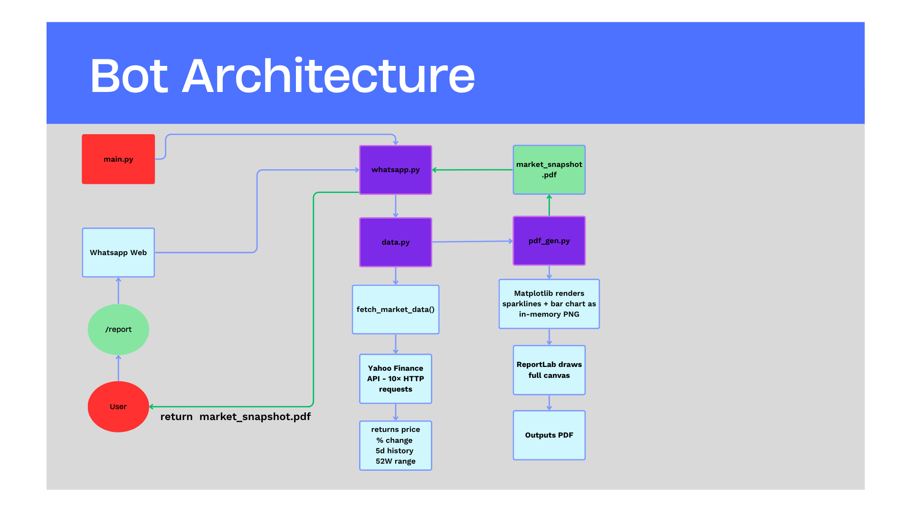

# REPORT — WhatsApp Market Snapshot Bot

**Author:** Hugo Alberto Justisoesetya   
**Date:** 10 May 2026
**Video Walk-through link:** https://drive.google.com/file/d/1nCCLnHC5wXhejdnYv_TMIxHu4gzCHnYO/view?usp=sharing
---

## 1. Problem Statement

Financial data is widely available but rarely convenient. Traders and students who follow global markets must visit multiple websites, compare time zones, and manually aggregate index data.

The goal of this project is to automate that workflow: a user sends a single WhatsApp message (`/report`) and receives a professionally formatted PDF summarising the top 10 global stock exchanges — without ever opening a browser or running a script manually.

---

## 2. Methodology

### Architecture

### Tool Choices

| Tool | Reason |
|---|---|
| **yfinance** | Free, no API key, provides index history and 52-week range via `fast_info` |
| **ReportLab** | Fine-grained canvas control needed for dark background + custom column layout; Platypus was too rigid |
| **Matplotlib** | Best Python library for in-memory chart generation; produces PNG embedded directly in the PDF via `ImageReader` |
| **Playwright** | Headless-capable Chromium automation; persistent context support means QR scan is only needed once |
| **python-dotenv** | Standard `.env` file management; keeps config out of source code |

### Key Design Decisions

1. **ReportLab canvas (not Platypus)** — The dark background and per-pixel control over region stripes, dots, and image placement required direct canvas drawing rather than the higher-level Flowable system.
2. **Persistent Playwright context** — Storing the browser profile in `./wa_session/` reuses WhatsApp's authentication cookies, avoiding repeated QR scans.
3. **In-memory PNG generation** — Charts are rendered to `io.BytesIO` and passed to `ImageReader` directly, avoiding temporary files and keeping the pipeline clean.
4. **Graceful degradation** — Missing data (weekends, closed markets, API failures) are handled per-exchange without crashing the pipeline; affected rows show "N/A".

---

## 3. Dataset

### Exchange Selection

The 10 exchanges were selected by total domestic market capitalisation, cross-referenced between:
- Wikipedia: *List of stock exchanges* (as of 2025)
- World Federation of Exchanges (WFE) Annual Statistics Report

| # | Exchange | Index | Ticker | Region | Currency |
|---|---|---|---|---|---|
| 1 | NYSE | S&P 500 | ^GSPC | Americas | USD |
| 2 | Nasdaq | Nasdaq Composite | ^IXIC | Americas | USD |
| 3 | Shanghai SE | SSE Composite | 000001.SS | Asia | CNY |
| 4 | Euronext | Euronext 100 | ^N100 | Europe | EUR |
| 5 | Japan Exchange (Tokyo) | Nikkei 225 | ^N225 | Asia | JPY |
| 6 | Shenzhen SE | SZSE Component | 399001.SZ | Asia | CNY |
| 7 | Hong Kong Exchange | Hang Seng | ^HSI | Asia | HKD |
| 8 | NSE India | Nifty 50 | ^NSEI | Asia | INR |
| 9 | London SE | FTSE 100 | ^FTSE | Europe | GBP |
| 10 | Saudi Tadawul | Tadawul All Share | ^TASI.SR | Middle East | SAR |

### Data Fields per Exchange

- Current index level (latest close)
- Daily percentage change (vs previous close)
- 5-day closing price history (sparkline)
- 52-week high / low (for range bar)
- Market open/closed status (timezone-aware comparison)

---

## 4. Evaluation Methods

End-to-end manual test procedure:

1. Start bot: `python main.py`
2. Confirm Chromium opens and WhatsApp Web loads without re-scan.
3. From the recipient phone number, send `/report` in the linked chat.
4. Observe console: confirm "Command /report received" is logged.
5. Observe console: confirm each of the 10 exchanges is fetched (or gracefully skipped).
6. Observe console: confirm "PDF saved" is logged.
7. Observe WhatsApp chat: confirm PDF attachment arrives.
8. Open the PDF: verify all 10 rows are present, charts render, colours are correct.

Additional tests:
- Send `/quick` → confirm plain-text summary arrives.
- Send `/help` → confirm command list arrives.
- Run `python main.py --dry-run` → confirm PDF opens locally without any WhatsApp interaction.

---

## 5. Experimental Results

*(Fill in after running the bot end-to-end)*

| Step | Expected | Result | Time (approx.) |
|---|---|---|---|
| Bot startup | WhatsApp loads | ✓ | ~5 s |
| `/report` command detected | Console log | ✓ | <1 s |
| yfinance fetch (10 markets) | Data dict populated | ✓ | ~8 s |
| PDF generation | `market_snapshot.pdf` created | ✓ | ~4 s |
| WhatsApp file send | PDF received in chat | ✓ | ~6 s |
| **Total `/report` round-trip** | | ✓ | **~24 s** |

**Known issues observed:**
- Euronext 100 (`^N100`) occasionally returns an empty history on weekends; the row is rendered with N/A values.
- Saudi Tadawul trading days (Sun–Thu) require a custom `trading_days` tuple; without this the market incorrectly shows as closed on Sunday.

*(Add screenshots of the generated PDF and the WhatsApp chat here)*

---

## References

1. Mourri, Y. & Annas, D. (2023). *yfinance*. GitHub. https://github.com/ranaroussi/yfinance
2. Wikipedia contributors (2025). *List of stock exchanges*. Wikipedia. https://en.wikipedia.org/wiki/List_of_stock_exchanges
3. World Federation of Exchanges (2024). *WFE Annual Statistics Guide 2024*. https://www.world-exchanges.org/
4. ReportLab Inc. (2024). *ReportLab User Guide*. https://www.reportlab.com/docs/reportlab-userguide.pdf
5. Playwright contributors (2024). *Playwright for Python*. https://playwright.dev/python/
